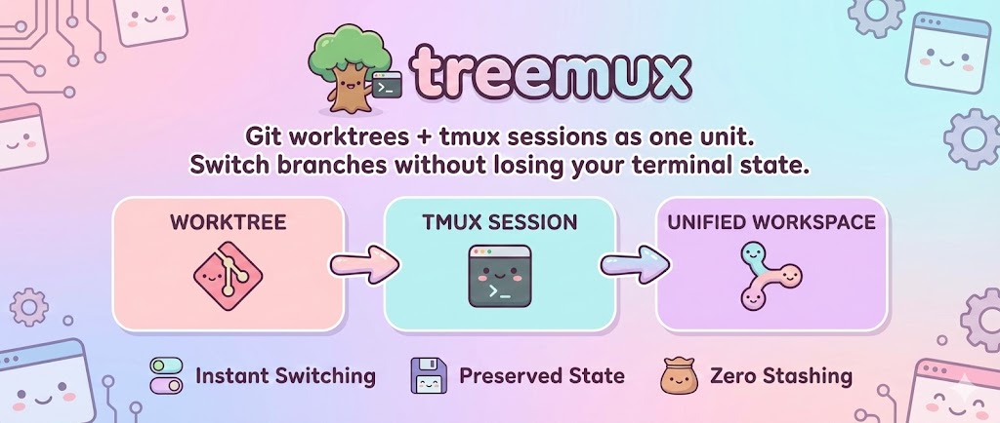
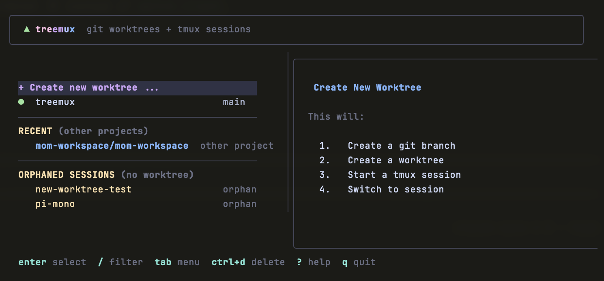

<p align="center">
  
</p>

# treemux

**Git worktrees + tmux sessions as one unit. Switch branches without losing your terminal state.**

[](LICENSE)
[]()

<p align="center">
  
</p>

## Install

**Download binary:**

Download the latest release for your platform from [GitHub Releases](https://github.com/nicobailon/treemux/releases).

```bash
# macOS (Apple Silicon)
curl -L https://github.com/nicobailon/treemux/releases/latest/download/treemux_darwin_arm64.tar.gz | tar xz
mv treemux /usr/local/bin/

# macOS (Intel)
curl -L https://github.com/nicobailon/treemux/releases/latest/download/treemux_darwin_amd64.tar.gz | tar xz
mv treemux /usr/local/bin/

# Linux (amd64)
curl -L https://github.com/nicobailon/treemux/releases/latest/download/treemux_linux_amd64.tar.gz | tar xz
mv treemux /usr/local/bin/
```

**Go install:**
```bash
go install github.com/nicobailon/treemux/cmd/treemux@latest
```

**From source:**
```bash
git clone https://github.com/nicobailon/treemux.git
cd treemux
go build -o treemux ./cmd/treemux
mv treemux ~/.local/bin/
```

**Requirements:** git, tmux

## Usage

```bash
treemux              # Open TUI
treemux list         # List worktrees and sessions
treemux clean        # Fix orphaned sessions/worktrees
treemux --help       # Help
```

> **Tip:** Add `alias tx="treemux"` to your shell config

## The Problem

Switching branches kills your flow:

```bash
git stash                    # hope you remember what you stashed
git checkout main            # lose your terminal state
npm install                  # dependencies changed
npm run dev                  # restart everything
# ... fix the bug ...
git checkout feature-branch
git stash pop                # pray it applies cleanly
npm install                  # restart again
# where was I?
```

Each switch costs 5-10 minutes reconstructing your environment.

## The Solution

**Worktrees isolate your files. Sessions isolate your environment.** A worktree alone means you still restart your dev server on every switch. A session alone means your files are still tangled. Paired together, they form complete workspaces - switch branches and your dev server is already running, your tests are already watching, your terminal history is intact.

treemux treats worktree + session as **one unit**:

1. **Create together** - New worktree automatically gets a dedicated session
2. **Switch together** - Jump to a worktree = switch to its session
3. **Delete together** - Remove worktree = kill its session
4. **Name together** - Session named after worktree folder

This eliminates orphaned sessions, worktrees without a "home", and manual bookkeeping.

## Keybindings

| Key | Action |
|-----|--------|
| `enter` | Jump to selected / Create new worktree |
| `/` | Filter worktrees |
| `tab` | Actions menu |
| `ctrl+d` | Quick delete worktree + session |
| `?` | Help |
| `q` / `esc` | Quit / Cancel |

## Interface

### Main View

- **Worktrees** with status indicators (green = clean, yellow = changes, purple = staged)
- **Recent** - Jump to worktrees in other projects
- **Orphaned Sessions** - Sessions without matching worktrees

### Preview Panel

- Path and branch info
- Git status (staged, modified, untracked)
- Ahead/behind upstream
- Session info and running processes
- Recent commits

## Common Workflows

### Feature Development

```
treemux → "+ Create new worktree" → enter
→ type "feature-auth" → enter → select "main" → enter
# Fresh workspace branched from main
```

### Urgent Hotfix

```
treemux → create "hotfix-123" from main
# Fix the bug, push, then:
treemux → select your feature workspace → enter
# Back to where you were, everything intact
```

### Jump Between Projects

The **Recent** section shows worktrees from other repos. Select one to instantly switch projects without leaving treemux.

### Managing Orphans

Orphaned sessions appear at the bottom. Select one to:
- **Jump** - Inspect before deciding
- **Adopt** - Create a worktree for the session
- **Kill** - Terminate the session

## Configuration

Create `~/.config/treemux/config.yaml`:

```yaml
base_branch: main
path_pattern: sibling    # or "subdirectory"
session_name: folder     # or "branch"
```

**Path patterns:**
- `sibling`: `~/dev/myrepo-feature` (next to repo)
- `subdirectory`: `~/dev/myrepo/.worktrees/feature` (inside repo)

## Limitations

- **Same branch, multiple worktrees**: Git doesn't allow this
- **Disk space**: Each worktree needs its own `node_modules`, build artifacts, etc.
- **External changes**: Worktrees/sessions created outside treemux sync on next launch

## Related

- [tmux](https://github.com/tmux/tmux) - Terminal multiplexer
- [git-worktree](https://git-scm.com/docs/git-worktree) - Git worktree documentation

## Inspiration

treemux builds on the **sessionizer** pattern popularized by [ThePrimeagen](https://github.com/ThePrimeagen). His tmux-sessionizer script pioneered the idea of project-based tmux sessions with fuzzy finding. treemux extends this concept specifically for git worktrees, adding the worktree + session pairing, orphan management, and a richer TUI.

## License

[MIT](LICENSE)
