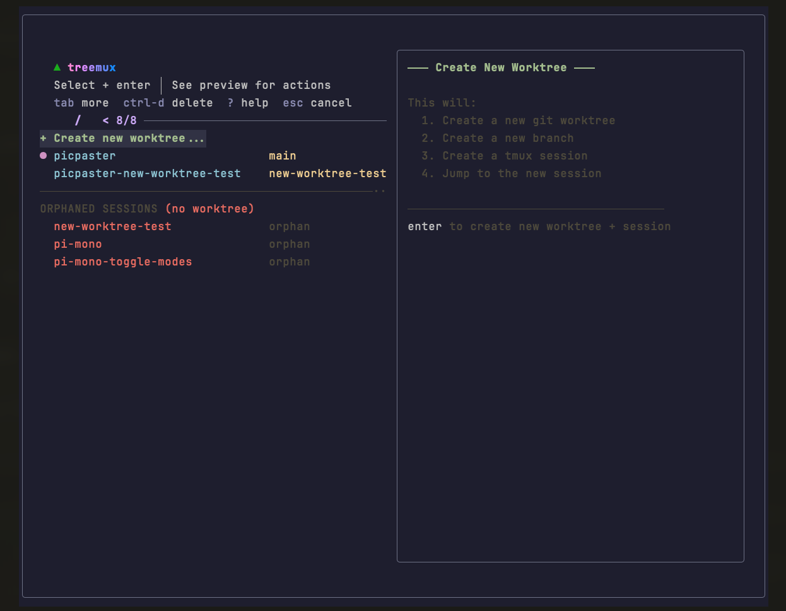
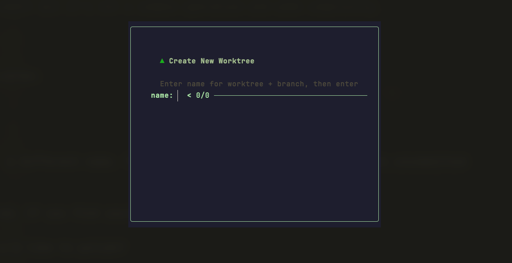
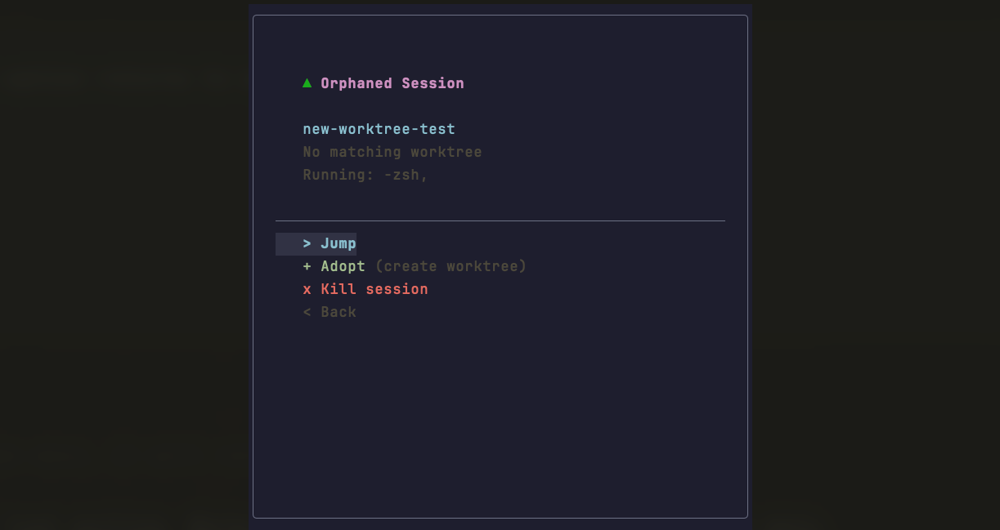

<p align="center">
  
</p>

# treemux

**Git worktrees + tmux sessions as one unit. Switch branches without losing your terminal state.**

[](LICENSE)
[]()

<p align="center">
  
  
  
</p>

```bash
treemux
```

## The Problem

Switching branches kills your flow:

```bash
git stash                    # hope you remember what you stashed
git checkout main            # lose your terminal state
npm install                  # dependencies changed
npm run dev                  # restart everything
# ... fix the bug ...
git checkout feature-branch
git stash pop                # pray it applies cleanly
npm install                  # restart again
# where was I?
```

Each switch costs 5-10 minutes reconstructing your environment.

## The Solution

**Worktrees isolate your files. Sessions isolate your environment.** A worktree alone means you still restart your dev server on every switch. A session alone means your files are still tangled. Paired together, they form complete workspaces - switch branches and your dev server is already running, your tests are already watching, your terminal history is intact.

treemux treats worktree + session as **one unit**:

1. **Create together** - New worktree automatically gets a dedicated session
2. **Switch together** - Jump to a worktree = switch to its session
3. **Delete together** - Remove worktree = kill its session
4. **Name together** - Session named after worktree folder

This eliminates orphaned sessions, worktrees without a "home", and manual bookkeeping.

## Quick Start

### Requirements

- zsh
- tmux
- fzf
- git

### Install

```bash
git clone https://github.com/nicobailon/treemux.git
cd treemux
./install.sh
```

Or manually:

```bash
cp treemux ~/.local/bin/
chmod +x ~/.local/bin/treemux
```

### Use

```bash
treemux              # Open TUI
treemux clean        # Fix orphaned sessions/worktrees
treemux -l           # List worktrees
treemux -h           # Help
```

> **Tip:** Add `alias tx="treemux"` to your `.zshrc`

## Keybindings

| Key | Action |
|-----|--------|
| `enter` | Jump to selected / Create new worktree / Manage orphan |
| `tab` | Actions menu (Jump, Delete, Kill session) |
| `ctrl-d` | Quick delete worktree + session |
| `?` | Help |
| `esc` | Cancel |

## Interface

### Main View

- **Worktrees** with status indicators:
  - `●` purple dot = current worktree
  - `no session` label = no active tmux session
- **Orphaned Sessions** at bottom - sessions without matching worktrees

### Preview Panel

- Path to worktree
- Git status (staged, modified, untracked)
- Ahead/behind upstream
- Session info (windows, panes)
- Running processes
- Recent commits

### Auto-Start

Run `treemux` outside tmux and it automatically creates a session and attaches.

## Common Workflows

### Feature Development

```
tx → select "+ Create new worktree" → enter
→ type "feature-auth" → enter → select "main" → enter
# You're in a fresh workspace branched from main
```

### Urgent Hotfix

```
tx → create "hotfix-123" from main
# Fix the bug, push, then:
tx → select your feature workspace → enter
# Back to where you were, everything intact
```

### Code Review

```
tx → create "review-pr-456" from main
git fetch origin pull/456/head:pr-456 && git checkout pr-456
# Review, then delete when done:
tx → select "review-pr-456" → ctrl-d → confirm
```

### Managing Orphans

Orphaned sessions appear at the bottom. Select one to:

- **Jump** - Inspect before deciding
- **Adopt** - Create a worktree for the session
- **Kill** - Terminate the session

## Configuration

Create `~/.config/treemux/config`:

```bash
# Default branch for new worktrees (default: auto-detect)
TREEMUX_BASE_BRANCH="main"

# Where to create worktrees: sibling (default) or subdirectory
#   sibling:      ~/dev/myrepo-feature (next to repo)
#   subdirectory: ~/dev/myrepo/.worktrees/feature (inside repo)
TREEMUX_PATH_PATTERN="sibling"

# Session naming: folder (default) or branch
TREEMUX_SESSION_NAME="folder"
```

## Gotchas & Limitations

### Git Limitations

- **Same branch, multiple worktrees**: Git doesn't allow the same branch checked out in multiple worktrees

### Disk Space

- Each worktree is a full file checkout
- Each needs its own `node_modules`, build artifacts, etc.

### Outside treemux

- Worktrees created via `git worktree add` won't have sessions (created on first jump)
- Sessions killed manually leave worktrees intact (shown as "no session")
- Worktrees deleted manually leave sessions orphaned (shown in orphaned section)

### IDE Integration

- JetBrains and VS Code handle worktrees well
- Some IDEs get confused - check your IDE's worktree support

## License

MIT
